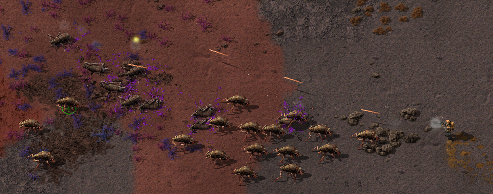
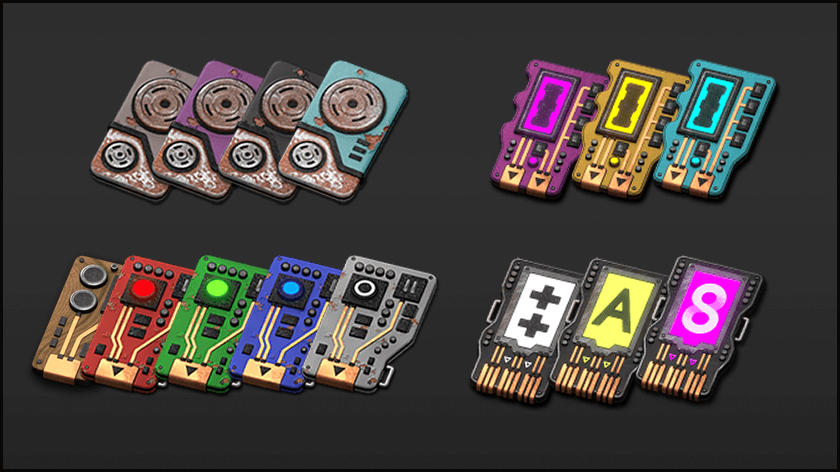
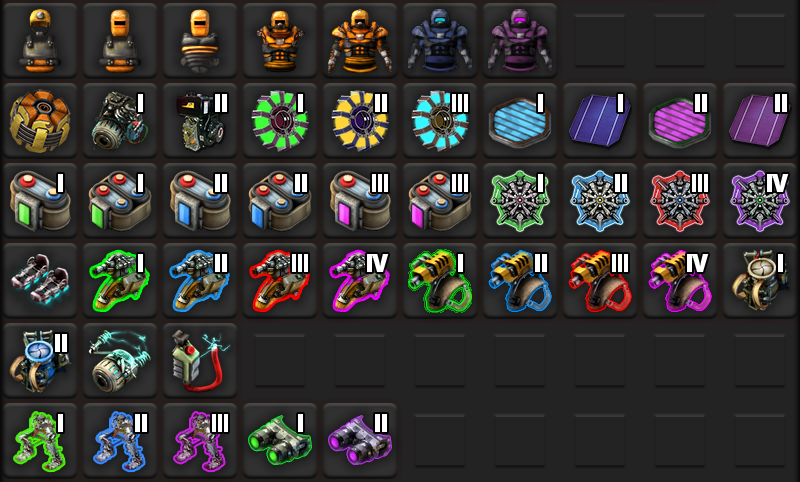

# Krastorio 2

Krastorio 2 is a mod for [Factorio](https://factorio.com) adding numerous new
buildings, items, technologies, and mechanics to the game. Originally developed
by Krastor and Linver, now maintained by raiguard.

## Installation

Download and install from the [official Factorio mod
portal](https://mods.factorio.com/mod/Krastorio2).

## Features

- All new high resolution animated sprites
- More than 300 new and _unique_ icons (not re-skinned variations of the same
icon)
- Over 40 new buildings
- Over 100 new technologies
- New weapons
- New resources
- A full combat overhaul
- More granular fuel trade-offs
- Radioactivity
- New tiles
- Compatibility with Space Exploration and Industrial Revolution 2
- Localization in over a dozen languages

... And much more!

### New resources

Three new resources have been added to the game:

- **Imersite:** A rare end-game resource used in many advanced recipes. This
material is useless on its own, but when used in advanced manufacturing
processes, exhibits ludicrous tensile strength and superconductive abilities.
- **Mineral Water:** Water impregnated with various silts and dusts from the
planet's surface. Used primarily in the production of lithium.
- **Rare Metals:** An analogous representation of various rare elements (i.e.
titanium, platinum, gold).

### Biter creep

Biters have evolved a passive defense mechanism that drastically slows down
other life-forms attempting to attack their hives. This Biter Creep is gross,
but will prove useful in your quest to vanquish the territorial bugs from this
world.

While the material must initially be harvested by hand, further research into
the species may yield a method of growing it in an automated fashion.

### Combat mechanics overhaul

Combat has been completely overhauled. Bullets are now physical objects that
have speed, wind resistance, and various AoE effects. Bullets have to travel
through space to their target, and can be blocked by solid objects.

Auto-aim is disabled by default, requiring the player to skillfully choose what
to aim at. This does not play nice with multiplayer latency, so an option to
re-enable auto-aim is included in the mod's startup settings.

### Science

Science progression has been majorly overhauled. Instead of science packs, you
produce tech cards that are inserted into research computers. There are three
tiers of tech card, each of which require their own laboratories.

Early-game tech cards will be phased out as the game progresses, allowing you
to redirect resources to other parts of your factory.

### Equipment

Higher tier equipment has been added, allowing for even greater quality of life
during the end-game. Almost all vehicles now have equipment grids.

### ... And more!

Your path may lead you to discoveries that, perhaps, should remain purely
science fiction.

## Compatibility

### Overhaul mods

Krastorio 2 and [Space
Exploration](https://mods.factorio.com/mod/space-exploration) have native
compatibility. Simply load both mods and it will "just work". The K2/SE
compatibility code is maintained by Trex on the Space Exploration discord
server. Please reach out to him for any balance issues or bugs.

Krastorio 2 has compatibility with [Angel's
mods](https://mods.factorio.com/user/Arch666Angel). This compatibility has not
been tested or maintained for several years, so there may be rough edges.
Please reach out if you run into any issues.

Krastorio 2 has rudimentary compatibility with the AngelBob's suite of mods.
This compatibility is not well-balanced and you will encounter issues in
gameplay, but it shouldn't crash.

Krastorio 2 has compatibility with [Industrial Revolution
2](https://mods.factorio.com/mod/IndustrialRevolution). However, it is not
compatible with IR3, and never will be. Because IR2 has been deprecated,
support for it will be removed in the near future.

### Recommended companion mods

The following mods are recommended by the Krastorio team to improve your experience:

- [Fluid Must Flow](https://mods.factorio.com/mod/FluidMustFlow) by the
Krastorio team
- [Alien Biomes](https://mods.factorio.com/mod/alien-biomes) by Earendel
- [Recipe Book](https://mods.factorio.com/mod/RecipeBook) by raiguard
- [Vehicle Snap](https://mods.factorio.com/mod/VehicleSnap) by Zaflis
- [Armoured Biters](https://mods.factorio.com/mod/ArmouredBiters) by CybranM

## Credits

### Mod Dev Team

- raiguard: Programmer & general maintainer

- Krastor: The namesake of the mod, created all of the graphics and designed
the mod's progression and overall concepts

- Linver: Programmer & SFX, implemented all of the mod's original code and
sound effects.

### Special Thanks

- BiusArt
  - For giving us permission to use [their
graphics](https://mods.factorio.com/mod/laborat) for the mod's second tier lab

- Bilka and Gangsir
  - For the achievement background gear art
  - With explicit consent of external use
  - Taken from the mod [More
Achievements](https://mods.factorio.com/mod/MoreAchievements) (0.5.1 - GNU
GPLv3)

- Nyoko
  - For the [Krastorio 2 theme song](https://youtu.be/x74grrke9qE)

- GeneralEcchi
  - For providing the fancy fluid icons
  - For help in the generation of light sprites
  - For rendering almost all of the light icons

- Wube
  - Some icons and sprites are imported from the previous version of Factorio.

Sounds were produced in-house or downloaded from free internet sources.
